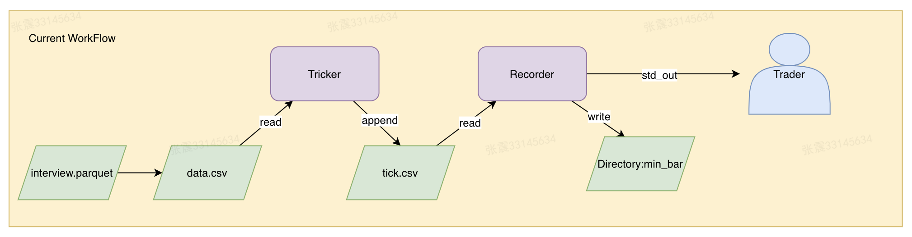
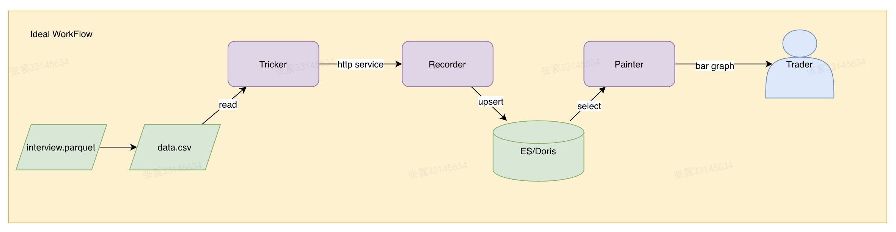

# 卓识基金
## 数据科学家笔试

### 1 数据检查
详见 [q1.ipynb](./src/q1.ipynb)或[data_check.py](./src/data_check.py)
有些步骤缺失或写的比较粗糙，还请担待

### 2 分钟bar合成
#### 2.1 如何启动

- 启动[Ticker.py](./src/Ticker.py)
  - 模拟流式数据，按照LocalTime顺序一条条到达，为方便测试模拟1s下发1000条
  - 流式数据append到[tick.csv](./src/tick.csv)
- 启动[Recorder.py](./src/Recorder.py)
  - 读取[tick.csv](./src/tick.csv)，模拟接受交易所接口数据
  - 为方便测试，1s（mock1分钟）计算一次，展示最新的20条数据，结果写入[min_bar](./src/min_bar)

#### 2.2 架构图
**当前架构**

**理想架构**

### 写到最后
最近工作比较忙，一直没有时间做这个小demo，利用周五晚上的时间，先粗略实现一版。有哪些步骤写的不详细或没有考虑到，欢迎私信或提issues

